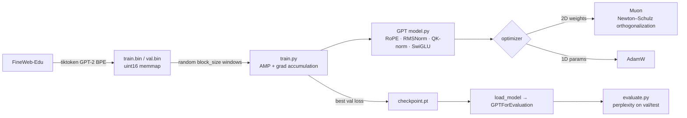
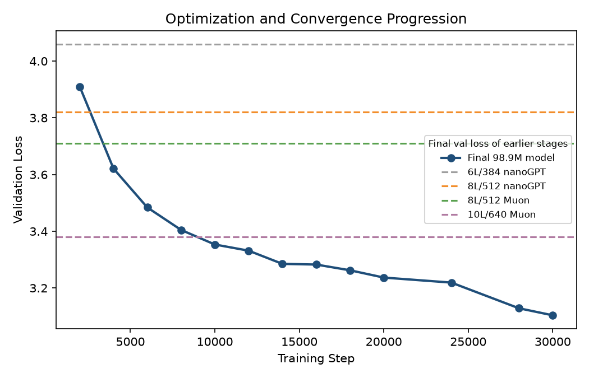
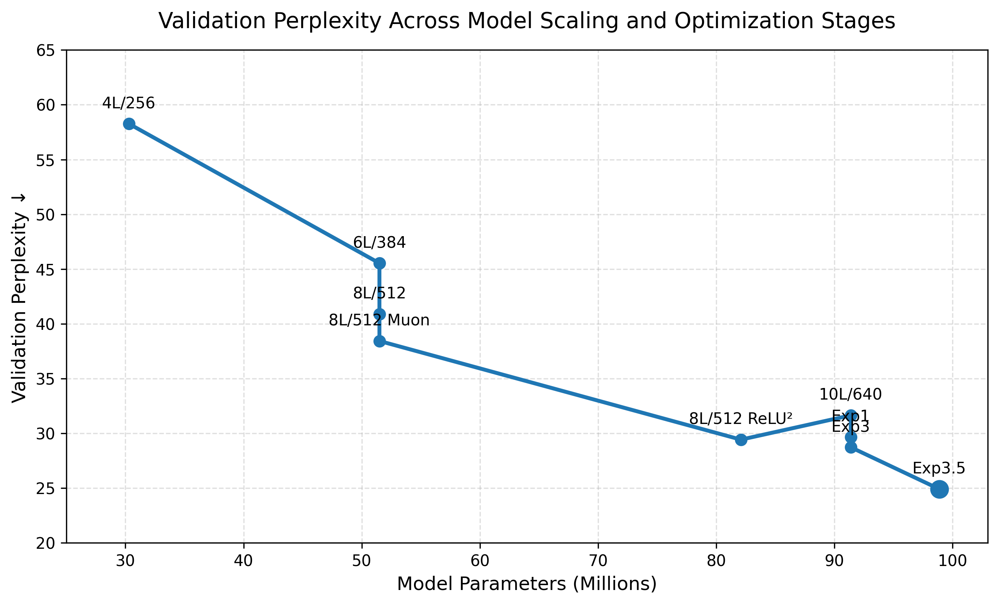
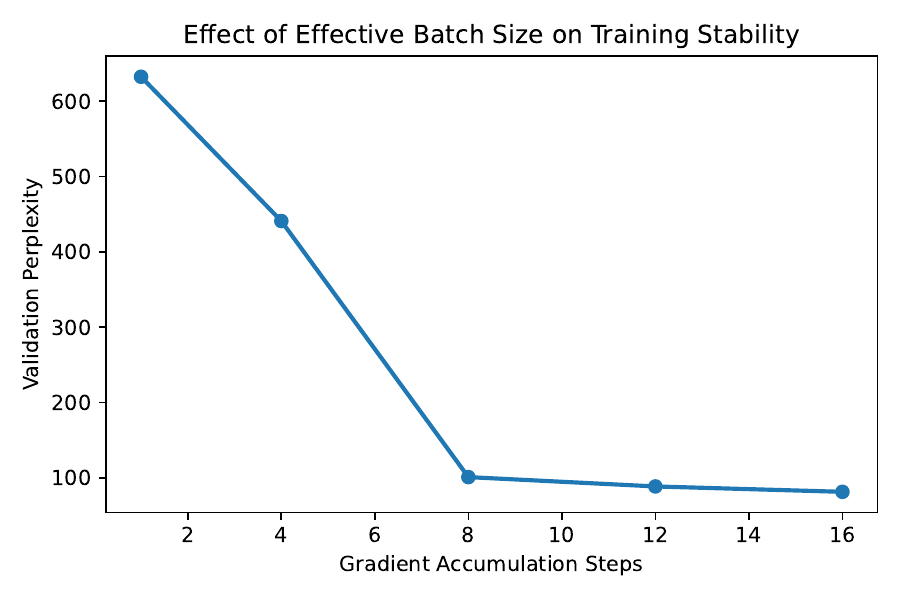

# NanoGPT Pretraining under 100M Parameters

Pretraining a GPT-style language model from scratch on FineWeb-Edu under a hard 100M-parameter budget. Built on nanoGPT, with a modernized architecture (RoPE, RMSNorm, QK-norm, SwiGLU) and a hand-written Muon optimizer.


## Overview

This was the team project for the **UCSD CSE 251B (Deep Learning, Spring 2026) NanoGPT competition**. The task was to train a language model with **at most 100M total parameters** that gets the lowest perplexity on a hidden test set. The test set comes from the same distribution as a public FineWeb-Edu-style validation split and is tokenized with GPT-2 BPE (vocab size 50,257). Everything apart from the parameter cap was open: architecture, optimizer, data and training procedure. Each submission also had to pass a fixed evaluation interface (`load_model()` returning logits) within a 5-minute inference limit.

The project covers most of an LLM pretraining workflow at small scale:

- tokenized data pipelines
- architecture choices under a parameter budget
- optimizer engineering
- batch-size and stability ablations
- systematic scaling experiments

The final model has **98.9M parameters** and reaches a **validation loss of 3.10 (perplexity ≈ 22.3) after 30k steps**.

## Highlights

- **A nanoGPT-derived decoder-only Transformer with modern components** (`model.py`):
  - rotary position embeddings (RoPE) in place of a learned position table
  - RMSNorm pre-normalization
  - per-head QK-norm in attention
  - SwiGLU MLPs (hidden width ≈ 8/3·d, rounded to a multiple of 8)
  - tied input/output embeddings
  - scaled residual-projection init
  - FlashAttention via `scaled_dot_product_attention`
- **A custom Muon optimizer** (`model.py`, class `Muon`):
  - Nesterov momentum, orthogonalized with a 5-step Newton–Schulz iteration in bfloat16 (falls back to SVD)
  - Muon updates all 2D weight matrices; AdamW handles the 1D parameters (norm gains)
  - one warmup + cosine LR multiplier drives both optimizers
- **A single-GPU training loop** (`train.py`):
  - mixed precision (bf16/fp16 with GradScaler) and gradient accumulation
  - gradient clipping and optional `torch.compile`
  - MFU estimation, W&B logging, and checkpoint/resume that keeps the state of both optimizers
- **A competition-ready submission interface**: `GPTForEvaluation` plus `load_model(checkpoint_path, device)` in `model.py`. Together they make the checkpoint loadable by the official `evaluate.py` with no extra changes.
- **Data pipelines for GPT-2-BPE `uint16` memmap shards**:
  - `data_karpathy/fineweb_10pct/prepare.py`: downloads, subsamples (every 10th document), tokenizes and splits FineWeb-Edu
  - `subset_train.py`: streams a random subset of pre-tokenized FineWeb-Edu 10B shards into `train.bin`/`val.bin` without loading everything into memory
  - Shakespeare pipelines for fast smoke tests
- **Experiments**:
  - a scaling and optimization study from 4L/256 up to the final ~99M model
  - a gradient-accumulation ablation of effective batch size versus validation perplexity

## How it works



**Model block (pre-norm):** `x + Attn(RMSNorm(x))`, then `x + SwiGLU(RMSNorm(x))`. Inside attention, Q and K are RMS-normalized per head, RoPE rotates them, and causal SDPA does the attention. The final RMSNorm feeds an LM head that shares weights with the token embedding.

**Optimizer split:** `GPT.configure_optimizers(..., optimizer_name='muon')` returns a `(Muon, AdamW)` pair:

| Parameters | Optimizer | Learning rate |
|---|---|---|
| 2D weight matrices | Muon (momentum 0.95, Nesterov) | 3e-3 |
| 1D parameters | AdamW | 1e-4 |

The training loop scales both learning rates with the same warmup + cosine multiplier. Use `--optim=adamw` for the standard decay/no-decay AdamW setup.

## Results

All numbers below are validation metrics logged during training (source: `plots.py`). Perplexity is computed as e^(val loss).

### Final model convergence

The final model has **98.9M parameters**. Its validation loss over training:

| Step | 2k | 4k | 6k | 8k | 10k | 14k | 20k | 24k | 28k | **30k** |
|---|---|---|---|---|---|---|---|---|---|---|
| Val loss | 3.9103 | 3.6211 | 3.4841 | 3.4048 | 3.3534 | 3.2851 | 3.2368 | 3.2191 | 3.1286 | **3.1038** |

For comparison, the earlier stages ended at these validation losses, from the reference lines in `plots.py`:

| Configuration | Val loss | Perplexity (e^loss) |
|---|---|---|
| nanoGPT 6L/384 | 4.06 | 58.0 |
| nanoGPT 8L/512 | 3.82 | 45.6 |
| Muon 8L/512 | 3.71 | 40.9 |
| Muon 10L/640 | 3.38 | 29.4 |
| **Final 98.9M model** | **3.10** | **22.3** |

At the same 8L/512 size, switching from AdamW to Muon lowered validation loss from 3.82 to 3.71.



### Scaling and optimization stages

The figure below shows validation perplexity against parameter count. It follows the stages from a 4L/256 baseline through 6L/384, 8L/512 (AdamW, then Muon), 8L/512 ReLU², 10L/640 and the follow-up experiments (Exp1, Exp3), ending at the final ~99M "Exp3.5" model.



### Effective batch size ablation

The ablation swept gradient-accumulation steps from 1 to 16. Validation perplexity falls steeply up to 8 accumulation steps and flattens after that, so small effective batches trained much worse.



## Tech stack

- **Core:** Python, PyTorch 2.x (SDPA/FlashAttention, AMP bf16/fp16, `torch.compile`), NumPy memmap data loading
- **Data:** tiktoken (GPT-2 BPE), Hugging Face `datasets` / `huggingface_hub`
- **Tooling:** matplotlib, Weights & Biases (optional)

## Repository structure

```
.
├── model.py                  # Team model: RoPE/RMSNorm/QK-norm/SwiGLU GPT, Muon optimizer, load_model() interface
├── train.py                  # Single-GPU training loop (AMP, grad accumulation, AdamW or Muon+AdamW, checkpoint/resume)
├── configurator.py           # nanoGPT-style config file / --key=value overrides
├── config.py                 # Export a checkpoint's model config to config.json (for submission)
├── subset_train.py           # Stream a random subset of FineWeb-Edu 10B .npy shards into train.bin/val.bin
├── evaluate.py               # Official competition evaluation script (perplexity), provided by course staff
├── model_example.py          # Course-provided example of the submission interface
├── plots.py / plots.ipynb    # Result plotting
├── scaling_results.{png,pdf} # Scaling / optimization-stage figure
├── training_curves.pdf       # Final-model convergence vs. baselines
├── grad_accum_ablation.pdf   # Effective batch size ablation
├── figures/                  # PNG renders of the PDF figures (for this README)
├── model_karpathy.py         # Original nanoGPT model (Andrej Karpathy, MIT) used as the baseline
├── train_karpathy.py         # Original nanoGPT training script (Andrej Karpathy, MIT)
├── config/                   # Original nanoGPT config files
└── data_karpathy/
    ├── fineweb_10pct/        # FineWeb-Edu 10% download + tokenization pipeline
    ├── shakespeare/          # GPT-2 BPE Shakespeare (smoke tests)
    ├── shakespeare_char/     # nanoGPT character-level Shakespeare
    └── openwebtext/          # nanoGPT OpenWebText prep
```

## Getting started

```bash
pip install -r requirements.txt
```

### 1. Prepare data

`train.py` reads `data/<dataset>/train.bin` and `data/<dataset>/val.bin`. These are `uint16` GPT-2 token IDs and are not committed. To build them:

```bash
# Option A: subsample FineWeb-Edu from Hugging Face and tokenize.
# Writes train.bin / val.bin / meta.pkl next to prepare.py.
python data_karpathy/fineweb_10pct/prepare.py
mkdir -p data/fineweb-10pct
mv data_karpathy/fineweb_10pct/{train.bin,val.bin,meta.pkl} data/fineweb-10pct/

# Option B: from pre-tokenized FineWeb-Edu 10B shards (edu_fineweb10B/*.npy).
# Writes data/fineweb-10pct-<N>/ using N randomly chosen train shards.
python subset_train.py --percent 10
```

For a quick smoke test on Shakespeare, run `python data_karpathy/shakespeare/prepare.py`, then copy its `train.bin`/`val.bin` into `data/shakespeare/`.

### 2. Train

Training settings are module-level variables in `train.py`. You can override any of them with `--key=value` or pass a nanoGPT-style config file:

```bash
# AdamW baseline
python train.py --dataset=fineweb-10pct-10 --n_layer=8 --n_head=8 --n_embd=512 \
    --batch_size=16 --gradient_accumulation_steps=8 --out_dir=out-8l512

# Muon (2D weights) + AdamW (1D params)
python train.py --dataset=fineweb-10pct-10 --optim=muon --n_layer=8 --n_head=8 --n_embd=512 \
    --batch_size=16 --gradient_accumulation_steps=8 --compile=True --out_dir=out-8l512-muon

# Resume from out_dir/checkpoint.pt
python train.py --init_from=resume --out_dir=out-8l512-muon
```

When validation loss improves, the loop saves `checkpoint.pt` to `out_dir`. At the end of the run it writes `loss_final.png`.

### 3. Evaluate (competition interface)

```bash
python config.py out-8l512-muon                       # writes out-8l512-muon/config.json
cp model.py out-8l512-muon/
python evaluate.py --model_dir out-8l512-muon/ --data val.bin
```

`val.bin` is the public validation split from the course starter repository and is not included here. `python model.py` runs a quick interface check: it builds a model, runs a dummy forward pass and asserts the logits shape.

## My contributions

Developed as a team project for the UCSD CSE 251B NanoGPT competition. My work focused on:

- **Model & submission interface:** implemented the nanoGPT GPT architecture in `model.py` and the `GPTForEvaluation` / `load_model()` wrapper that makes checkpoints loadable by the official evaluator
- **Training loop:** wrote the single-GPU `train.py` that the final training pipeline was built on
- **Data pipelines:** the FineWeb-Edu 10% preparation pipeline (`data_karpathy/fineweb_10pct/`) and the Shakespeare setup used to verify the pipeline end to end
- **Analysis:** results analysis and plotting (`plots.py`) and the gradient-accumulation (effective batch size) ablation

## Acknowledgements

- **Baseline:** [nanoGPT](https://github.com/karpathy/nanoGPT) by Andrej Karpathy (MIT). `model_karpathy.py`, `train_karpathy.py`, `configurator.py`, `config/` and the `data_karpathy/{shakespeare,shakespeare_char,openwebtext}` scripts come from it, and `model.py`/`train.py` are derived from it.
- **Muon:** follows the Newton–Schulz orthogonalization approach popularized by [modded-nanogpt](https://github.com/KellerJordan/modded-nanogpt).
- **Course:** UCSD CSE 251B, Spring 2026. The competition starter (`evaluate.py`, `model_example.py`, rules and validation split) was provided by the course staff.

## License

MIT, see [LICENSE](LICENSE). The files derived from nanoGPT keep Andrej Karpathy's original MIT copyright notice, which is reproduced in the LICENSE file.

See [`NOTICE`](NOTICE) for third-party components and data licenses.
